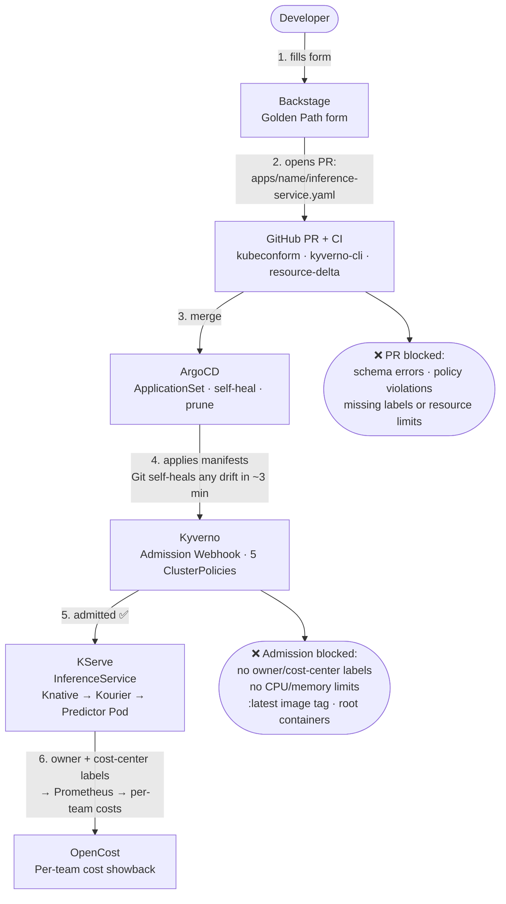
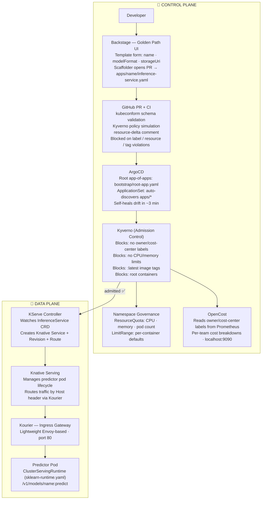
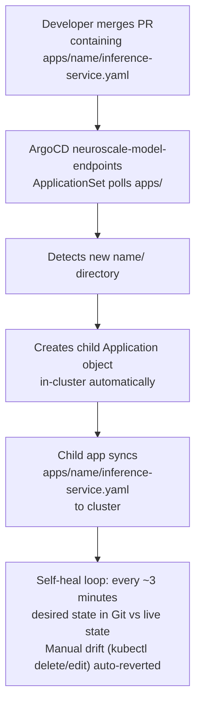
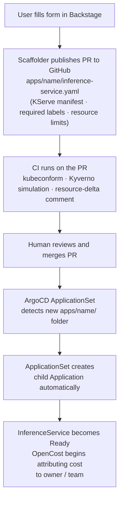

# NeuroScale Platform

> A production-hardened AI inference platform that solves configuration drift,
> the Backstage adoption paradox, and the gap between AI code generation and governed
> production deployment — with 21 verified checks across 6 milestones.

## Proof: smoke test output (single command, any machine)

```
$ bash scripts/smoke-test.sh

━━━ Milestone A — GitOps Spine ━━━
  [✓ PASS] All ArgoCD pods are Running
  [✓ PASS] ArgoCD Applications: 7/7 Healthy and Synced
  [✓ PASS] Drift self-heal: nginx-test recreated in ~20s

━━━ Milestone B — AI Serving Baseline ━━━
  [✓ PASS] KServe controller-manager: 1 replica available
  [✓ PASS] InferenceServices: 2/2 Ready=True
  [✓ PASS] Inference request: demo-iris-2 → {"predictions":[1,1]}

━━━ Milestone C — Golden Path ━━━
  [✓ PASS] Backstage deployment: 1 replica available
  [✓ PASS] demo-iris-2 InferenceService exists (scaffolder output)
  [✓ PASS] demo-iris-2 ArgoCD Application exists (scaffolder output)

━━━ Milestone D — Guardrails ━━━
  [✓ PASS] Kyverno ClusterPolicies installed: 5 policies
  [✓ PASS] Non-compliant InferenceService correctly denied

━━━ Milestone E — Cost + Portability ━━━
  [~ SKIP] Resource-delta PR comment + bootstrap script validated in CI (no live cluster checks)

━━━ Milestone F — Production Hardening ━━━
  [✓ PASS] ApplicationSet generates 3 child Applications
  [✓ PASS] ResourceQuota exists in default namespace
  [✓ PASS] OpenCost deployment healthy

  PASS  21 / FAIL  0 / SKIP  1
```

> **Executive Summary:** NeuroScale is a self-service AI inference platform on Kubernetes. A developer fills in a Backstage form, the platform creates a pull request, ArgoCD deploys it, and a production-grade KServe inference endpoint is live — with cost attribution, drift control, and policy guardrails enforced automatically at every stage.

---

## Table of Contents

- [Proof: Smoke Test Output](#proof-smoke-test-output-single-command-any-machine)

1. [Why NeuroScale Exists: Addressing 2026 ML Infrastructure Pain Signals](#1-why-neuroscale-exists-addressing-2026-ml-infrastructure-pain-signals)
2. [Architecture: Control Plane and Data Plane](#2-architecture-control-plane-and-data-plane)
3. [System Flow: How Everything Connects](#3-system-flow-how-everything-connects)
   - [GitOps: How Deployments Are Triggered](#31-gitops-how-deployments-are-triggered)
   - [Backstage: How Services Are Cataloged and Scaffolded](#32-backstage-how-services-are-cataloged-and-scaffolded)
   - [KServe: How Inference Is Handled](#33-kserve-how-inference-is-handled)
4. [Repository Map](#4-repository-map)
5. [Milestone status: what's verified and what breaks it](#5-milestone-status-whats-verified-and-what-breaks-it)
   - [What Each Milestone Cost to Build](#what-each-milestone-cost-to-build-the-failures-not-the-happy-path)
6. [Quickstart: Running the Demo Locally](#6-quickstart-running-the-demo-locally)
7. [Reality Check Documentation](#7-reality-check-documentation)
8. [Guardrails: What Gets Blocked and Why](#8-guardrails-what-gets-blocked-and-why)
9. [Operational Runbook: ArgoCD Sync Recovery, KServe Restart, and Backstage Token Refresh](#9-operational-runbook-argocd-sync-recovery-kserve-restart-and-backstage-token-refresh)
10. [Platform Architecture: Key Design Decisions and Where They Live](#10-platform-architecture-key-design-decisions-and-where-they-live)
11. [GitHub Topics & Repository Discoverability](#11-github-topics-repository-discoverability)

---

## 1. Why NeuroScale Exists: Addressing 2026 ML Infrastructure Pain Signals

The 2026 platform engineering pain signals this repo directly addresses:

| Pain | Industry Signal | NeuroScale Answer |
|------|----------------|-------------------|
| Complexity / cognitive load | Developers shouldn't need Kubernetes expertise to deploy a model | Backstage Golden Path template — one form, one PR |
| Reliability / drift | Manual cluster changes break overnight | ArgoCD GitOps — Git is the source of truth; drift is auto-corrected |
| Governance & security | Unsafe configs reach production | Kyverno admission policies + CI policy simulation |
| Cost waste | No resource bounds = unbounded spend | Required requests/limits + `owner`/`cost-center` labels enforced before merge + live OpenCost showback |
| Scale friction | Adding a new service requires editing GitOps boilerplate | ApplicationSet auto-discovers new model folders — zero registration overhead |

---

## 2. Architecture: Control Plane and Data Plane

### Component interaction diagram



### Mermaid detail: Control Plane and Data Plane



---

## 3. System Flow: How Everything Connects

### 3.1 GitOps: How Deployments Are Triggered

GitOps in NeuroScale is implemented with **ArgoCD app-of-apps + ApplicationSet**. There is one root Application (`bootstrap/root-app.yaml`) that watches `infrastructure/apps/`. That directory contains both static Application manifests for platform infrastructure and one `ApplicationSet` that auto-discovers model endpoint folders.

**Trigger chain (new model deployment):**



**Key design decision — why ApplicationSet instead of per-app Application files:**

- Previously each new model required a manual `infrastructure/apps/<name>-app.yaml` file. This was purely mechanical boilerplate.
- The ApplicationSet replaces all those files. Drop a folder under `apps/`, and ArgoCD discovers and deploys it automatically.
- The platform scales to hundreds of services without any GitOps layer changes.

**Automated sync settings** (from `bootstrap/root-app.yaml`):

```yaml
syncPolicy:
  automated:
    prune: true
    selfHeal: true
```

`selfHeal: true` means ArgoCD continuously reconciles. `prune: true` means resources removed from Git are removed from the cluster.

### 3.2 Backstage: How Services Are Cataloged and Scaffolded

Backstage serves two functions in NeuroScale:

**a) Service Catalog** — every deployed inference service is a cataloged Component with ownership metadata. The `owner` and `cost-center` labels required by Kyverno feed directly into catalog attribution.

**b) Golden Path Scaffolder** — the `KServe model endpoint` template at `backstage/templates/model-endpoint/template.yaml` generates the file required by the GitOps pipeline:



**The critical non-obvious piece:** Backstage is *not* the deployment engine. It is the UX that generates Git artifacts. ArgoCD is the deployment engine. This separation means Backstage can be down without affecting running inference endpoints.

### 3.3 KServe: How Inference Is Handled

KServe operates in **serverless mode** (Knative-based) in this platform. The request path for a deployed `InferenceService` named `demo-iris-2` is:

```mermaid
flowchart TD
    CURL["curl request\n(with Host header)"]
    KOURIER["Kourier\nsvc/kourier · kourier-system · port 80"]
    KN["Knative Route → Knative Revision\nroutes by Host: name-predictor.default.domain"]
    POD["Predictor Pod\nsklearn-runtime image · port 8080"]
    RESP["Response\n/v1/models/demo-iris-2:predict\n→ {\"predictions\":[1,1]}"]
    CURL --> KOURIER --> KN --> POD --> RESP
```

**Why Kourier instead of Istio:** The cluster runs on local k3d with constrained RAM. Istio adds ~1 GB memory overhead. Kourier is a minimal Envoy-based gateway that Knative supports natively and costs ~100 MB. The ingress config patch at `infrastructure/serving-stack/patches/inferenceservice-config-ingress.yaml` sets `disableIstioVirtualHost: true` to signal this choice to KServe.

**ClusterServingRuntime:** `infrastructure/kserve/sklearn-runtime.yaml` defines a reusable runtime that all sklearn-based `InferenceService` objects reference. This separates *how to serve* from *what to serve*, allowing the runtime image to be patched in one place.

---

## 4. Repository Map

```
neuroscale-platform/
|-- bootstrap/
|   +-- root-app.yaml                    # GitOps entrypoint: seeds ArgoCD app-of-apps
|
|-- infrastructure/
|   |-- apps/                            # ArgoCD child Application manifests
|   |   |-- model-endpoints-appset.yaml  # ApplicationSet: auto-discovers apps/* folders
|   |   |-- backstage-app.yaml           # Backstage (Helm, dev profile)
|   |   |-- serving-stack-app.yaml       # KServe + Knative + Kourier install
|   |   |-- kserve-runtimes-app.yaml     # ClusterServingRuntime definitions
|   |   |-- policy-guardrails-app.yaml   # Kyverno + policies (sync-wave 20)
|   |   |-- default-namespace-resources-app.yaml  # ResourceQuota + LimitRange (wave 5)
|   |   +-- opencost-app.yaml            # OpenCost cost showback (sync-wave 30)
|   |-- backstage/
|   |   |-- Chart.yaml                   # Helm chart wrapper for Backstage
|   |   |-- values.yaml                  # Dev profile: guest auth, 1 replica, loose limits
|   |   +-- values-prod.yaml             # Prod profile: GitHub OAuth, 2 replicas, hard limits
|   |-- kserve/
|   |   +-- sklearn-runtime.yaml         # ClusterServingRuntime (sklearn)
|   |-- kyverno/
|   |   |-- kyverno-install-v1.12.5.yaml
|   |   +-- policies/                    # Admission + audit policies (5 ClusterPolicies)
|   |       |-- require-standard-labels-inferenceservice.yaml
|   |       |-- require-standard-labels-deployment.yaml
|   |       |-- require-resource-requests-limits.yaml
|   |       |-- disallow-latest-image-tag.yaml
|   |       +-- disallow-root-containers.yaml  # (Milestone F) runAsNonRoot enforced
|   |-- namespaces/
|   |   +-- default/                     # (Milestone F) ResourceQuota + LimitRange
|   |       |-- resource-quota.yaml
|   |       |-- limit-range.yaml
|   |       +-- kustomization.yaml
|   |-- opencost/                        # (Milestone F) OpenCost cost showback
|   |   |-- Chart.yaml
|   |   +-- values.yaml
|   |-- serving-stack/
|   |   |-- kustomization.yaml           # cert-manager + Knative + Kourier + KServe install
|   |   +-- patches/                     # Istio->Kourier config, kube-rbac-proxy removal
|   +-- INCIDENT_BACKSTAGE_CRASHLOOP_RCA.md
|
|-- apps/
|   |-- test-app/deployment.yaml         # Simple workload for drift self-heal demo
|   |-- ai-model-alpha/                  # First inference service (Milestone B)
|   +-- demo-iris-2/                     # Golden Path output (Milestone C)
|
|-- backstage/
|   +-- templates/model-endpoint/        # Scaffolder template (Golden Path)
|
|-- scripts/
|   |-- bootstrap.sh                     # One-shot cluster setup (any laptop → running platform)
|   |-- smoke-test.sh                    # Colour-coded end-to-end smoke test (all 6 milestones)
|   |-- port-forward-all.sh              # Open all UIs in one command (ArgoCD + Backstage + OpenCost + Kourier)
|   +-- ci/
|       +-- render_backstage.sh          # Renders Backstage Helm chart for schema validation
|
|-- .github/workflows/
|   +-- guardrails-checks.yaml           # CI: kubeconform + Kyverno simulation + cost proxy
|
|-- docs/
|   |-- archive/
|   |   |-- MILESTONE_A_POSTMORTEM.md           # GitOps spine: incidents + design decisions
|   |   |-- MILESTONE_B_POSTMORTEM.md           # KServe: incidents + design decisions
|   |   +-- MILESTONE_C_POSTMORTEM.md           # Golden Path: contract, incidents, runbook
|   |-- PROJECT_MEMORY.md
|   |-- CLOUD_PROMOTION_GUIDE.md            # Phase-by-phase EKS/GKE promotion guide
|   |-- REALITY_CHECK_MILESTONE_1_GITOPS_SPINE.md
|   |-- REALITY_CHECK_MILESTONE_2_KSERVE_SERVING.md
|   |-- REALITY_CHECK_MILESTONE_3_GOLDEN_PATH.md
|   |-- REALITY_CHECK_MILESTONE_4_GUARDRAILS.md
|   |-- REALITY_CHECK_MILESTONE_5_COST_PROXY.md
|   +-- REALITY_CHECK_MILESTONE_6_PRODUCTION_HARDENING.md
|
+-- README.md
```

---

## 5. Milestone status: what's verified and what breaks it

| Milestone | Business problem eliminated | Verified by smoke test |
|-----------|-----------------------------|------------------------|
| **A — GitOps spine** | Configuration drift — any manual `kubectl` change is auto-reverted; infrastructure is recoverable via `git revert` | `[✓ PASS] Drift self-heal: nginx-test recreated in ~20s` |
| **B — AI serving baseline** | Inference with no deployment path — KServe is GitOps-managed; a new model is a PR, not a kubectl command | `[✓ PASS] InferenceServices: 2/2 Ready=True` · `[✓ PASS] Inference request: demo-iris-2 → {"predictions":[1,1]}` |
| **C — Golden Path** | Backstage adoption paradox — developers interact with a form, not Kubernetes YAML; the platform handles the rest | `[✓ PASS] demo-iris-2 InferenceService exists (scaffolder output)` |
| **D — Guardrails** | Security theater — policies that appear to work but don't block anything; the `kyverno-cli` false-green was undetected for 2 weeks before being fixed | `[✓ PASS] Non-compliant InferenceService correctly denied` |
| **E — Cost + portability** | No cost accountability — unbounded resource consumption with no ownership trail; any engineer can reproduce the full platform on a laptop in one command | `[~ SKIP] Resource-delta PR comment + bootstrap script validated in CI` |
| **F — Production hardening** | Scale friction — adding a new model required manual GitOps boilerplate; ApplicationSet eliminates that entirely | `[✓ PASS] ApplicationSet generates 3 child Applications` · `[✓ PASS] OpenCost deployment healthy` |

---

## What each milestone cost to build (the failures, not the happy path)

| Milestone | Hardest failure | Time lost | Business impact |
|-----------|----------------|-----------|-----------------|
| A — GitOps spine | ArgoCD `Unknown` state caused by repo-server CrashLoopBackOff — looks like a manifest error but is a controller connectivity failure | 40 min | Zero drift correction during outage window |
| B — KServe serving | Default KServe config assumes Istio; `disableIstioVirtualHost` is not disclosed in getting-started docs | 3 hours | All InferenceService creation blocked cluster-wide |
| C — Backstage Golden Path | 9 distinct failures; CI false-green on Kyverno policy violations for 2 weeks | ~6 hours | PR-time enforcement was silently not enforcing |
| D — Guardrails | `kyverno-cli apply` exits 0 on violations; `$PIPESTATUS[0]` required | 2 weeks undetected | Guardrails existed but did not enforce |
| E — Cost + portability | `$patch: delete` in a Kustomize file deleted the live CRD cluster-wide; all InferenceServices gone in seconds | 4 min recovery | SEV-1 equivalent: all inference endpoints deleted simultaneously |
| F — Production hardening | Backstage `dangerouslyDisableDefaultAuthPolicy` vs `dangerouslyAllowOutsideDevelopment` — these are different with different security implications | 1 hour diagnosis | Silent security exposure in production profile |

Full Reality Check documentation for each milestone: [7. Reality Check Documentation](#7-reality-check-documentation)

Full Backstage CrashLoopBackOff incident postmortem: [infrastructure/INCIDENT_BACKSTAGE_CRASHLOOP_RCA.md](infrastructure/INCIDENT_BACKSTAGE_CRASHLOOP_RCA.md)

---

## 6. Quickstart: Running the Demo Locally

### Prerequisites

- Docker Desktop (or Rancher Desktop)
- `k3d` installed
- `kubectl` installed
- `helm` installed

### First-time setup on any laptop

```bash
# One command creates the cluster, installs ArgoCD, and applies the root app:
bash scripts/bootstrap.sh
```

The script checks all prerequisites, creates the k3d cluster, installs ArgoCD, and prints the admin password and port-forward commands when finished.

### Resume an existing cluster (daily startup)

```bash
k3d cluster start neuroscale
kubectl config use-context k3d-neuroscale
```

### Verify the platform is healthy

```bash
# Run the colour-coded smoke test (tests all 6 milestones):
bash scripts/smoke-test.sh

# Skip the destructive drift test for a quick sanity check:
bash scripts/smoke-test.sh --skip-drift
```

### Morning health gate (manual checks)

```bash
kubectl get nodes
kubectl -n argocd get applications.argoproj.io
kubectl -n kserve get deploy,pods
kubectl -n default get inferenceservices.serving.kserve.io
kubectl -n default get resourcequota,limitrange
kubectl get clusterpolicies
```

### Open all UIs at once (new in Milestone F)

```bash
# Opens ArgoCD + Backstage + OpenCost + Kourier in one command:
bash scripts/port-forward-all.sh
```

This starts all four port-forwards as background processes and prints a URL table with credentials. Press Ctrl+C to stop all tunnels.

### Open required tunnels (individually)

```bash
# Terminal 1 -- ArgoCD UI
kubectl port-forward svc/argocd-server -n argocd 8081:443
# Open: https://localhost:8081

# Terminal 2 -- Backstage portal
kubectl -n backstage port-forward svc/neuroscale-backstage 7010:7007
# Open: http://localhost:7010

# Terminal 3 -- OpenCost cost dashboard
kubectl -n opencost port-forward svc/opencost-ui 9090:9090
# Open: http://localhost:9090

# Terminal 4 -- Inference gateway (Kourier)
kubectl -n kourier-system port-forward svc/kourier 8082:80
```

### Demo: GitOps drift self-heal (Milestone A)

```bash
# Confirm workload exists
kubectl get deploy nginx-test -n default

# Create intentional drift
kubectl delete deploy nginx-test -n default

# Wait and verify self-heal
sleep 20
kubectl get deploy nginx-test -n default
```

### Demo: Inference request (Milestone B / C)

```bash
# Get predictor pod name
kubectl -n default get pods | grep "demo-iris-2.*Running"

# Port-forward to predictor runtime directly (deterministic local proof)
kubectl -n default port-forward pod/<predictor-pod-name> 18080:8080

# Send prediction
curl -sS -H "Content-Type: application/json" \
  -d '{"instances":[[6.8,2.8,4.8,1.4],[6.0,3.4,4.5,1.6]]}' \
  http://127.0.0.1:18080/v1/models/demo-iris-2:predict
# Expected: {"predictions":[1,1]}
```

### Demo: Policy block (Milestone D)

```bash
# Try to apply a non-compliant InferenceService (missing owner/cost-center labels)
kubectl apply -f - <<EOF
apiVersion: serving.kserve.io/v1beta1
kind: InferenceService
metadata:
  name: bad-model
  namespace: default
spec:
  predictor:
    sklearn:
      storageUri: gs://kfserving-examples/models/sklearn/1.0/model
EOF
# Expected: admission webhook denial from Kyverno
```

---

## 7. Reality Check Documentation

**This platform was not built on the happy path.** Every milestone hit real failures. The docs below document what broke, the exact terminal output, the root cause, and the business impact.

| Milestone | Reality Check Document | Key Failures Documented |
|-----------|------------------------|-------------------------|
| A — GitOps Spine | [docs/REALITY_CHECK_MILESTONE_1_GITOPS_SPINE.md](docs/REALITY_CHECK_MILESTONE_1_GITOPS_SPINE.md) | ArgoCD repo-server `connection refused`; Argo `Unknown` comparison state; app stuck not syncing |
| B — KServe Serving | [docs/REALITY_CHECK_MILESTONE_2_KSERVE_SERVING.md](docs/REALITY_CHECK_MILESTONE_2_KSERVE_SERVING.md) | Istio vs Kourier ingress mismatch; `kube-rbac-proxy` ImagePullBackOff; Knative CRD rendering conflict |
| C — Golden Path | [docs/REALITY_CHECK_MILESTONE_3_GOLDEN_PATH.md](docs/REALITY_CHECK_MILESTONE_3_GOLDEN_PATH.md) | Backstage CrashLoopBackOff (Helm values mis-nesting); blank `/create/actions` (401 on scaffolder); PR merged but app stayed OutOfSync |
| D — Guardrails | [docs/REALITY_CHECK_MILESTONE_4_GUARDRAILS.md](docs/REALITY_CHECK_MILESTONE_4_GUARDRAILS.md) | InferenceService CRD removed by patch; Kyverno label name mismatch; CI policy simulation false-green (fixed in Milestone E) |
| E — Cost Proxy + Portability | [docs/REALITY_CHECK_MILESTONE_5_COST_PROXY.md](docs/REALITY_CHECK_MILESTONE_5_COST_PROXY.md) | CI false-green root cause + fix; cost proxy design trade-offs; bootstrap script decisions |
| F — Production Hardening | [docs/REALITY_CHECK_MILESTONE_6_PRODUCTION_HARDENING.md](docs/REALITY_CHECK_MILESTONE_6_PRODUCTION_HARDENING.md) | ApplicationSet design; namespace quota reasoning; OpenCost label strategy; multi-env Backstage values; guest auth vs disabled auth |

Full incident postmortem for the Backstage CrashLoopBackOff: [infrastructure/INCIDENT_BACKSTAGE_CRASHLOOP_RCA.md](infrastructure/INCIDENT_BACKSTAGE_CRASHLOOP_RCA.md)

---

## 8. Guardrails: What Gets Blocked and Why

### Admission-time enforcement (Kyverno)

| Policy | What It Blocks | Business Reason |
|--------|---------------|-----------------|
| `require-standard-labels-inferenceservice` | InferenceService without `owner` + `cost-center` labels | Cost attribution is impossible without ownership metadata; OpenCost relies on these labels |
| `require-standard-labels-deployment` | Deployment without `owner` + `cost-center` labels | Same attribution requirement for non-inference workloads |
| `require-resource-requests-limits` | Deployment without CPU/memory requests and limits | Unbounded resources cause node contention and unpredictable cost |
| `disallow-latest-image-tag` | Deployment with `:latest` image | Non-reproducible rollouts; breaks rollback guarantees |
| `disallow-root-containers` | Deployment containers without `runAsNonRoot: true` | Container breakout from root containers can escalate to host access |

### Namespace-level governance (ResourceQuota + LimitRange)

| Resource | Request cap | Limit cap | Reason |
|----------|------------|-----------|--------|
| CPU (aggregate) | 4 cores | 8 cores | Prevents unbounded consumption on a shared cluster |
| Memory (aggregate) | 8 Gi | 16 Gi | Prevents OOM cascades across all namespaced workloads |
| Pods | — | 20 | Bounds KServe's hidden pod proliferation (1 ISVC → ~5 pods) |
| InferenceServices | — | 5 | Bounds total active model endpoints in default namespace |

### PR-time enforcement (CI)

| Check | Tool | What It Catches |
|-------|------|----------------|
| Schema validation | `kubeconform` | Malformed YAML, wrong API versions, missing required fields |
| Policy simulation | `kyverno-cli apply` + stdout check | Policy violations against actual rendered manifests before merge (dual exit-code + stdout check guards against false-greens) |
| Helm rendering | `helm template` + `render_backstage.sh` | Helm values hierarchy bugs (the exact failure class from the Backstage RCA) |
| Resource delta | Python + PyYAML | CPU/memory requests in changed `apps/` manifests; posts as PR comment and GitHub Actions job summary |

---

## 9. Operational Runbook: ArgoCD Sync Recovery, KServe Restart, and Backstage Token Refresh

See `docs/archive/MILESTONE_C_POSTMORTEM.md` for the full runbook.

**Common recovery commands:**

```bash
# Restart ArgoCD repo-server (most common ArgoCD instability fix)
kubectl -n argocd rollout restart deploy/argocd-repo-server
kubectl -n argocd rollout status deploy/argocd-repo-server --timeout=120s

# Refresh a stuck ArgoCD application
kubectl -n argocd patch application <app-name> \
  --type merge -p '{"metadata":{"annotations":{"argocd.argoproj.io/refresh":"hard"}}}'

# Check KServe controller health
kubectl -n kserve get deploy kserve-controller-manager
kubectl -n kserve describe deploy kserve-controller-manager

# Refresh Backstage GitHub token
read -s GITHUB_TOKEN
kubectl -n backstage create secret generic neuroscale-backstage-secrets \
  --from-literal=GITHUB_TOKEN="$GITHUB_TOKEN" \
  --dry-run=client -o yaml | kubectl apply -f -
kubectl -n backstage rollout restart deploy/neuroscale-backstage
```

---

## 10. Platform Architecture: Key Design Decisions and Where They Live

| Question | Where to Point |
|----------|---------------|
| "Walk me through the GitOps flow" | Section 3.1 + `bootstrap/root-app.yaml` + `infrastructure/apps/model-endpoints-appset.yaml` |
| "How does Backstage trigger a deployment?" | Section 3.2 + `backstage/templates/model-endpoint/template.yaml` |
| "How does KServe handle a request?" | Section 3.3 + `infrastructure/kserve/sklearn-runtime.yaml` |
| "How do you prevent bad configs from reaching prod?" | Section 8 + `infrastructure/kyverno/policies/` |
| "How do you prevent containers running as root?" | `infrastructure/kyverno/policies/disallow-root-containers.yaml` |
| "How do you prevent runaway resource consumption?" | `infrastructure/namespaces/default/resource-quota.yaml` + `limit-range.yaml` |
| "How do you attribute costs to teams?" | `owner`/`cost-center` labels enforced by Kyverno + OpenCost dashboard at localhost:9090 |
| "Show me a real incident you've debugged" | `infrastructure/INCIDENT_BACKSTAGE_CRASHLOOP_RCA.md` |
| "What failed and what did you learn?" | `docs/REALITY_CHECK_MILESTONE_*.md` |
| "Why Kourier instead of Istio?" | Section 3.3 + `docs/REALITY_CHECK_MILESTONE_2_KSERVE_SERVING.md` |
| "How can I verify the platform works on my laptop?" | `scripts/bootstrap.sh` + `scripts/smoke-test.sh` + `scripts/port-forward-all.sh` |
| "How do you scale from 3 models to 300?" | ApplicationSet in `infrastructure/apps/model-endpoints-appset.yaml` — zero GitOps boilerplate per model |
| "What's different between dev and prod Backstage?" | `infrastructure/backstage/values.yaml` vs `values-prod.yaml` — replicas, auth provider, limits, probe thresholds |
| "How would you promote this to a real cloud cluster?" | `docs/CLOUD_PROMOTION_GUIDE.md` — phase-by-phase: EKS/GKE Terraform, ArgoCD bootstrap, ingress swap, wildcard DNS, TLS (cert-manager or ACM), production Backstage, OpenCost billing API |

---

> **Note:** This repo runs on local k3d (zero-cost, fully reproducible). The cloud promotion path — EKS/GKE Terraform, ingress swap, DNS, TLS, production Backstage — is documented step-by-step in [`docs/CLOUD_PROMOTION_GUIDE.md`](docs/CLOUD_PROMOTION_GUIDE.md). The application manifests require no changes to run on a cloud cluster; only the cluster and network layer changes.

---

## 11. GitHub Topics & Repository Discoverability

### Recommended topics for this repository

The following topics accurately reflect what is built and documented here. Add them via
**Settings → About (gear icon) → Topics**:

```
kubernetes kserve backstage gitops argocd platform-engineering mlops kyverno opencost technical-writing
```

**Why each topic is earned, not aspirational:**

| Topic | Evidence in this repo |
|-------|----------------------|
| `kubernetes` | All workloads are Kubernetes-native (InferenceServices, Deployments, ResourceQuotas, Namespaces) |
| `kserve` | `infrastructure/kserve/`, `apps/*/inference-service.yaml`, Milestone B fully verified |
| `backstage` | `backstage/templates/model-endpoint/`, `infrastructure/backstage/`, Helm wrapper with dev + prod values |
| `gitops` | ArgoCD root app-of-apps (`bootstrap/root-app.yaml`), self-healing drift control, Milestone A verified |
| `argocd` | `infrastructure/apps/*.yaml`, ApplicationSet auto-discovery, Milestone F verified |
| `platform-engineering` | End-to-end platform: developer portal → GitOps → inference serving → cost attribution |
| `mlops` | Self-service model endpoint lifecycle: scaffold → deploy → serve → monitor cost |
| `kyverno` | 5 ClusterPolicies in `infrastructure/kyverno/policies/`, CI policy simulation, Milestone D verified |
| `opencost` | `infrastructure/opencost/`, `owner`/`cost-center` label enforcement, Milestone E verified |
| `technical-writing` | 11 documents across `docs/` including reality-check postmortems and a full incident RCA |

> **Rule of thumb:** only add a topic if someone clicking it would immediately find that technology in the repo.
> Keyword-stuffing topics that have no corresponding code or docs undermines credibility and wastes a
> recruiter's time.

---

### Why the repository shows "100% Shell" on GitHub

GitHub uses a tool called [Linguist](https://github.com/github/linguist) to detect languages and render
the coloured language bar on a repository's main page.  Linguist splits file types into two categories:

| Linguist category | Counted in language bar? | Examples in this repo |
|-------------------|--------------------------|-----------------------|
| **Programming language** | ✅ Yes | Shell (`.sh`) |
| **Data / markup** | ❌ No (by default) | YAML (`.yaml`, `.yml`) |

YAML is classified as a *data* language, so Linguist silently omits it from the bar even when it is the
primary output artifact — which is exactly the situation here.  The four Shell scripts total ~34 KB; the
custom Kubernetes manifests, ArgoCD apps, Helm values, and Kyverno policies total ~20–25 KB of
handwritten YAML.

A `.gitattributes` file has been added to this repository that sets `linguist-detectable=true` on all
YAML files.  Once GitHub re-indexes the repository, the language bar will reflect a more representative
split (approximately Shell 60% / YAML 40%).  The large upstream Kyverno operator install manifest
(`infrastructure/kyverno/kyverno-install-v1.12.5.yaml`, ~3 MB of downloaded YAML) is marked
`linguist-vendored=true` so that it does not inflate the YAML percentage.

**Does "100% Shell" reduce the quality of the work? No.**  The language bar is a file-type summary,
not an assessment of engineering depth.  The value in this repository is in the *architecture*: a
working GitOps loop, a governed ML serving layer, policy-as-code, cost attribution, and a Golden Path
developer experience — all verifiable with a single command (`bash scripts/smoke-test.sh`).  The Shell
scripts are operational glue (bootstrap, smoke-test, port-forwarding) that exist *because* the platform
is real and runnable, not despite it.
