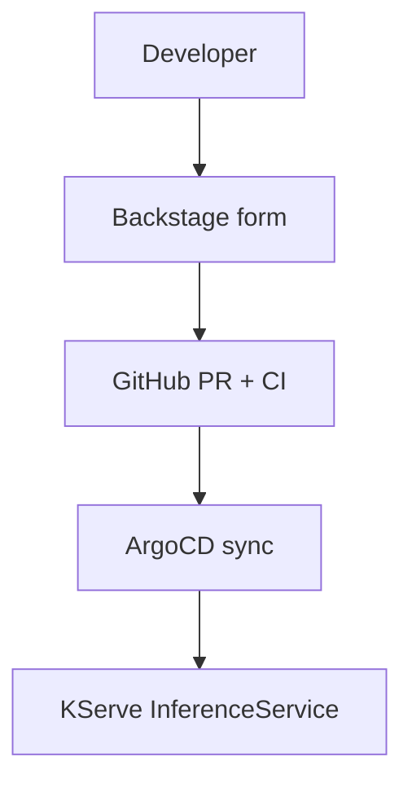

# Architecture Diagram Guide

This document explains what type of architecture diagram to use, and where,
in this repository and in GitHub projects generally.

---

## Quick reference

| Context | Recommended type | Why |
|---------|-----------------|-----|
| `README.md` overview or flow | **Mermaid** | Renders natively on GitHub; editable as plain text; version-controlled alongside code |
| Detailed design doc / ADR | **Real diagram image** (PNG/SVG) | Full visual clarity; supports complex layouts; ideal for presentations and stakeholder reviews |
| Ultra-simple inline explanation | **ASCII art** | Zero dependencies; works in any terminal or plain-text viewer; best for 3–5 box diagrams only |

---

## Mermaid — use for README and in-repo docs

Mermaid diagrams are written as fenced code blocks:

````markdown

````

**When to use Mermaid:**

- Architecture overview in `README.md`
- System flow / request path diagrams
- GitOps trigger chains
- Component interaction diagrams
- Any diagram that will change as code changes (keep diagram and code in sync)

**Mermaid diagram types used in this repo:**

| Diagram type | Used for |
|---|---|
| `flowchart TD` / `flowchart TB` | Component interaction, request flow, trigger chains |
| `flowchart LR` | Left-to-right pipeline stages |
| `sequenceDiagram` | Time-ordered message flows between services |
| `graph` | Dependency graphs |

**Advantages:**

- Renders natively on GitHub (no image upload needed)
- Plain text: diffable, reviewable in PRs
- Easy to update as the system evolves
- No external tools required

**Limitations:**

- Complex diagrams with many crossing edges can look crowded
- Cannot express spatial/physical topology (network zones, cloud regions)
- No custom styling beyond built-in themes

---

## Real diagram image — use for formal design docs

A real diagram is an exported PNG or SVG created with a tool such as
[draw.io / diagrams.net](https://app.diagrams.net),
[Lucidchart](https://www.lucidchart.com), or
[Figma](https://www.figma.com).

**When to use a real diagram image:**

- Architecture Decision Records (ADRs) shared with stakeholders
- Cloud network topology (VPCs, subnets, availability zones, peering)
- Deployment target diagrams (EKS node groups, ingress paths, TLS termination)
- Presentation slides or design review documents
- Diagrams with many components where spatial layout matters

**Convention for this repo:**  
Store exported images in `docs/diagrams/` and commit both the source file
(`.drawio` or `.fig`) and the exported PNG/SVG so either can be regenerated.

---

## ASCII art — use only for tiny, text-only diagrams

ASCII art requires no tooling but looks rough at scale. Reserve it for
diagrams with three to five boxes that appear inside shell output, code
comments, or terminal documentation.

**Example — acceptable use (tiny, inline):**

```
Developer → GitHub PR → ArgoCD → Cluster
```

**Not recommended for:**

- Diagrams with more than ~6 components
- Diagrams that need to be maintained over time
- Any diagram displayed in a public-facing README

---

## What NeuroScale uses and why

All architecture diagrams in `README.md` use **Mermaid**.  
The reasons match the guidance above:

1. The README is the primary entry point for the repo — Mermaid renders
   immediately on GitHub without any extra steps.
2. The platform evolves (new milestones, new components); plain-text diagrams
   are updated in the same PR as the code they describe.
3. The diagrams represent logical flow (not physical network topology), which
   is exactly where Mermaid excels.

If this platform is ever promoted to a cloud environment and a stakeholder
design review is needed, create a real diagram image in `docs/diagrams/` that
shows the cloud topology (VPC, subnets, EKS node groups, ALB, Route 53).
The Mermaid diagrams in the README remain as the day-to-day developer reference.

---

## Decision rule (one sentence)

> **README and in-repo docs → Mermaid; formal design docs / presentations → real image; three-box inline explanation → ASCII.**
